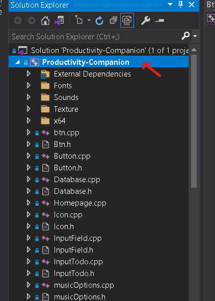
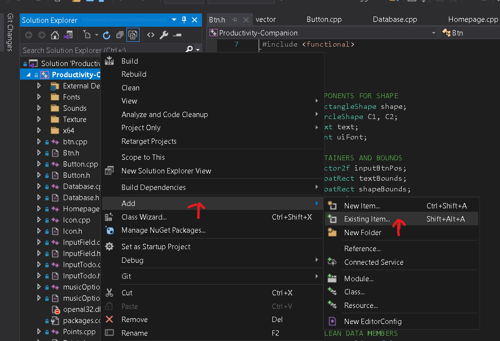
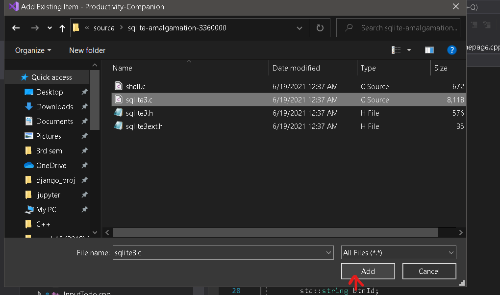

# Productivity-Companion
>Being productive and leaping towards perfection always been a topic of high regard in the present world. Practices like to-do listing, session tracking, task scheduling, pomodoro technique, music studying etc. are proven to be more effective. In this project we intend to integrate these practices into a single application, which would be of great help to not only us but to many scholars worldwide.
---
## Requirements:
- You'll need to download the zip file of sqilite3 api.[Click here to download ](https://www.sqlite.org/2021/sqlite-amalgamation-3360000.zip)
- Extract the fiiles from zip and save them in your device.

###Setting up sqlite3:
1. From the solution explorer right click on the main project.

1. From the menu click on *Add* and then on *Existing Item*. 

1. Browse to the folder containing extracted sqlite3 files and Select *sqlite3.c* and click add Button. 

**Now you're ready to build !!!**